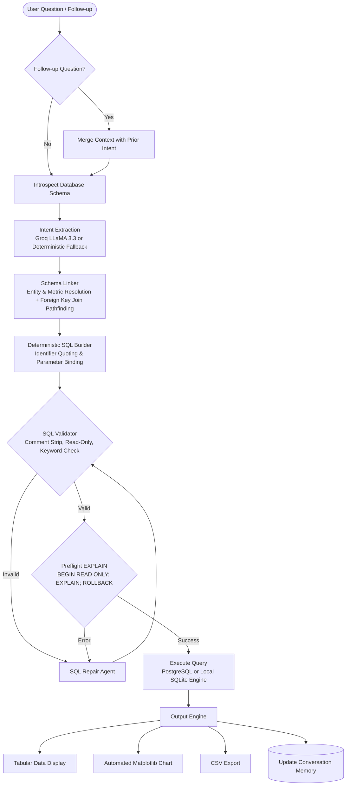

# QueryNative: Schema-Aware Natural Language to SQL Analytics Engine

[](https://www.python.org/)
[](https://www.postgresql.org/)
[](https://flask.palletsprojects.com/)
[](https://www.sqlite.org/)
[](https://groq.com/)
[](LICENSE)

**QueryNative** is an enterprise-grade, schema-aware Natural Language-to-SQL (NL2SQL) analytics platform. It translates plain-English business questions into syntactically valid, read-only SQL queries, executes them against live relational databases or uploaded datasets, and visualizes the results with interactive tables and automated charts.

Unlike generic text-to-SQL wrappers, QueryNative enforces a **deterministic, multi-stage analytics pipeline**: dynamic database catalog introspection, relational graph join resolution, multi-layered AST-like security validation, read-only transaction containment, and multi-turn conversational context resolution.

---

## Key Capabilities

* **Dual-Engine Architecture**:
  * **Live PostgreSQL Engine**: Connects dynamically to any local or cloud PostgreSQL database using `psycopg2`. Introspects relational metadata via PostgreSQL's `information_schema` on the fly.
  * **Local File Ingestion Engine**: Accepts `.csv`, `.xlsx`, `.sql` dumps, and `.sqlite` files. Employs Pandas and SQLAlchemy to perform delimiter sniffing, automatic data type inference, primary/foreign key detection, and persistent SQLite ingestion.
* **Dynamic Schema Discovery & Relational Linking**:
  * Programmatically inspects tables, column data types, primary keys, and foreign keys.
  * Automatically resolves multi-table relationships and computes optimal `JOIN` chains using Breadth-First Search (BFS) graph traversal.
  * Dynamically computes derived metrics (e.g., automatically calculating `SUM(unit_price * quantity)` when "sales" or "revenue" is requested across order detail tables).
* **Multi-Layered SQL Security & Defensive Validation**:
  * **Syntax & Keyword Guardrails**: Sanitizes literals/comments to prevent evasion, blocks multiple statements (semicolon prohibition), enforces read-only `SELECT`/`WITH` queries, and rejects destructive keywords (`DROP`, `DELETE`, `UPDATE`, `ALTER`, `TRUNCATE`, `GRANT`, etc.).
  * **Preflight Database Verification**: Validates generated queries against PostgreSQL using isolated preflight execution (`BEGIN READ ONLY; EXPLAIN <query>; ROLLBACK;`).
  * **Transactional Confinement**: Executes all user queries inside strictly enforced read-only database transactions.
* **Self-Healing SQL Repair**:
  * If a query fails preflight validation or database execution, a single-shot repair cycle submits the schema, failed SQL, and engine error back to the parser to produce a corrected statement before returning.
* **Deterministic Offline Fallback**:
  * Powered by Groq's `llama-3.3-70b-versatile` for structured intent extraction, with a built-in heuristic regex and schema-matching fallback parser (`nlp/text_parser.py`) ensuring zero downtime when offline.
* **Multi-Turn Conversational Memory**:
  * Retains a sliding 20-turn conversation memory. Detects follow-up questions (e.g., *"now group by year"*, *"only in USA"*, *"show top 5"*) and merges new filters and grouping constraints into prior query intents.
* **Automated Data Visualization & Export**:
  * Generates server-side Matplotlib charts (bar charts, horizontal bars, time-series line graphs, and proportion pie charts) based on result cardinality and data types.
  * Supports single-click CSV export of generated query result sets.

---

## System Architecture & Query Pipeline



### Detailed Pipeline Breakdown

1. **Context & Intent Resolution**:
   The engine checks whether the prompt is a standalone question or a conversational continuation. Follow-ups inherit base metrics and tables while overlaying new filters or dimensions.
2. **Dynamic Schema Introspection**:
   The database catalog is queried (`information_schema.tables`, `columns`, `table_constraints`, `key_column_usage`, `constraint_column_usage`). Tables, datatypes, and foreign key relationships (`table.fk → ref_table.pk`) are structured into the active context.
3. **Structured Intent Extraction**:
   The question and schema context are mapped into a strongly-typed JSON schema:
   ```json
   {
     "entity": "orders",
     "aggregation": "sum",
     "group_by": "category",
     "limit": 5,
     "order_by": "DESC",
     "time_dimension": null,
     "resolved_base_table": "order_details",
     "resolved_metric_column": "unit_price * quantity",
     "resolved_group_table": "categories",
     "resolved_group_column": "category_name"
   }
   ```
4. **Relational Schema Linking & Join Pathfinding**:
   `schema/schema_linker.py` and `sql_engine/query_builder.py` match target entities to database tables. If the base table (e.g., `order_details`) and the grouping table (e.g., `categories`) differ, a Breadth-First Search (BFS) traverses the relational foreign key graph to construct the exact sequence of `JOIN` clauses required.
5. **Security Validation & Preflight Compilation**:
   `sql_engine/query_validator.py` strips comments and string literals, verifies that only a single `SELECT` or `WITH` statement exists, checks against forbidden DDL/DML tokens, and executes `EXPLAIN` against PostgreSQL inside a rolled-back read-only transaction.
6. **Execution & Visualization**:
   The query is executed in a read-only transaction. The returned records are rendered as a clean data table, evaluated for visual charting (bar, horizontal bar, line, or pie based on data shape and temporal columns), and made available for immediate CSV download.

---

## Technical Stack

| Layer | Technologies | Purpose |
| :--- | :--- | :--- |
| **Backend & API** | Python 3, Flask | Core application server, REST API endpoints, transaction management |
| **Relational Database** | PostgreSQL, `psycopg2-binary` | Cloud/local relational querying, `information_schema` catalog discovery |
| **Local Ingestion Engine** | SQLite, SQLAlchemy, Pandas, openpyxl | In-memory/on-disk tabular data parsing, type inference, local querying |
| **SQL Engine** | Python AST/Regex, BFS Graph Traversal | Parameterized SQL compilation, join pathfinding, query validation |
| **Natural Language / LLM** | Groq (`llama-3.3-70b-versatile`) | Zero-shot structured intent parsing and automated SQL repair |
| **Visualization & Reporting**| Matplotlib, Tabulate | Server-side data-to-chart rendering (Base64 PNG) and tabular formatting |
| **Frontend UI** | HTML5, CSS3, Vanilla JavaScript | Self-contained, responsive dark-mode interface (no Node.js build step) |

---

## Project Structure

```text
query_native/
├── app.py                     # Flask web server, REST API routes, memory management
├── main.py                    # Interactive 6-step CLI application
├── run.py                     # Web application entry point (port 5000)
├── upload_handler.py          # Local ingestion engine (CSV/XLSX/SQL/SQLite → SQLite)
├── requirements.txt           # Python package dependencies
├── .env.example               # Template for environment variables
├── .gitignore                 # Excludes .env, caches, and local databases
├── db/
│   ├── db_connection.py       # PostgreSQL connection lifecycle & config manager
│   ├── schema_catalog.py      # Relational metadata models (ColumnMeta, TableMeta, Catalog)
│   ├── schema_discovery.py    # PostgreSQL information_schema introspection queries
│   └── schema_map.py          # Relational map generator (tables, columns, foreign keys)
├── nlp/
│   ├── groq_parser.py         # Groq LLM integration (structured intent & SQL repair)
│   └── text_parser.py         # Deterministic regex/keyword fallback parser
├── schema/
│   └── schema_linker.py       # Maps parsed intent to catalog entities & metrics
├── sql_engine/
│   ├── query_builder.py       # SQL generator with BFS relational join pathfinding
│   ├── query_validator.py     # Multi-stage security validation & preflight check
│   └── sql_executor.py        # Read-only transaction execution engine
├── templates/
│   └── index.html             # Full-featured single-page web UI (HTML5/CSS3/Vanilla JS)
└── visualizer/
    └── visualize.py           # CLI tabular printer and Matplotlib visualizer
```

---

## Installation & Quickstart

### Prerequisites

* Python 3.10+
* (Optional) An active PostgreSQL database (e.g., local PostgreSQL, AWS RDS, Neon, Supabase)
* (Optional) A Groq API key for LLM intent parsing (fallback parser functions offline without a key)

### 1. Clone the Repository

```bash
git clone https://github.com/yourusername/querynative.git
cd querynative
```

### 2. Set Up a Virtual Environment

```bash
# Windows
python -m venv venv
venv\Scripts\activate

# macOS / Linux
python3 -m venv venv
source venv/bin/activate
```

### 3. Install Dependencies

```bash
pip install -r requirements.txt
```

### 4. Configure Environment Variables

Copy the provided `.env.example` to `.env`:

```bash
cp .env.example .env
```

Edit `.env` and supply your Groq API key:

```env
GROQ_API_KEY=gsk_your_groq_api_key_here
```

*(Note: If no API key is provided, QueryNative automatically operates using the local deterministic heuristic parser).*

---

## Running the Application

### Option A: Web User Interface (Recommended)

Start the Flask web server:

```bash
python run.py
```

Open your browser and navigate to:
```text
http://127.0.0.1:5000
```

1. **Connect a Database**: Click **Connect / Upload** in the sidebar. Enter your PostgreSQL connection details (`host`, `port`, `dbname`, `user`, `password`) and click **Connect**.
2. **Or Upload a File**: Switch to the **Upload File** tab and drop any `.csv`, `.xlsx`, `.sql`, or `.sqlite` dataset. Click **Use This Schema**.
3. **Ask Questions**: Ask ad-hoc questions in plain English (e.g., *"Top 5 customers by revenue"*, *"Monthly order count in 2024"*, *"Average product price by category"*).
4. **Inspect Pipeline**: Click through the transparent pipeline accordion to view the extracted intent JSON, schema links, security validation, and final SQL query.
5. **Export Results**: Click **Export CSV** to download result sets directly.

### Option B: Terminal / CLI Mode

QueryNative provides an interactive terminal interface running the full 6-step pipeline:

```bash
python main.py
```

---

## REST API Reference

QueryNative exposes a modular REST API:

| Endpoint | Method | Description |
| :--- | :--- | :--- |
| `/` | `GET` | Serves the single-page web application |
| `/api/connect` | `POST` | Validates credentials, connects to PostgreSQL, and introspects schema |
| `/api/connection` | `GET` | Returns active connection status, host, database name, and table count |
| `/api/query` | `POST` | End-to-end endpoint: resolves context, extracts intent, builds SQL, executes, and charts |
| `/api/upload` | `POST` | Ingests `.csv`, `.xlsx`, `.sql`, or `.sqlite` files into the local SQLite engine |
| `/api/upload/activate`| `POST` | Switches the active query engine from PostgreSQL to the uploaded dataset |
| `/api/upload/deactivate`| `POST`| Reverts the active query engine back to the configured PostgreSQL database |
| `/api/upload/status` | `GET` | Retrieves metadata, row counts, and schema ID for uploaded files |
| `/api/upload/reset` | `POST` | Cleans up and deletes temporary on-disk SQLite files |
| `/api/schema` | `GET` | Returns the complete relational schema dictionary and row counts |
| `/api/memory` | `GET` | Retrieves the active multi-turn conversation memory history |
| `/api/memory` | `DELETE`| Clears conversation history and resets session context |
| `/api/export/csv` | `POST` | Generates a downloadable CSV file from an executed query result set |
| `/api/autocomplete` | `GET` | Returns query structure suggestions based on partial user input |

---

## Data Analyst & Engineering Highlights

For Data Analysts, Analytics Engineers, and Database Developers, QueryNative illustrates foundational data principles in production:

* **Relational Data Modeling & Integrity**: Directly inspects relational schemas, resolves entity-relationship constraints via foreign keys, and prevents fan-out/chasm traps during multi-table joins.
* **SQL Query Optimization & Performance**: Automatically restricts data retrieval using precise projections and `LIMIT` clauses, groups on indexed dimensions, and utilizes PostgreSQL's query planner (`EXPLAIN`) for validation.
* **Complex Aggregations & Metrics Calculation**: Accurately constructs multi-column aggregate metrics (e.g., `SUM(unit_price * quantity)`), handles temporal aggregations using `EXTRACT(YEAR/MONTH FROM date)`, and supports windowed ranking.
* **Security & Defensive Engineering**: Implements enterprise database access standards: non-destructive read-only transactions, strict sanitization against SQL injection, and granular query preflights.
* **Self-Contained Full-Stack Data Delivery**: Combines Python data engineering (`pandas`, `sqlalchemy`, `psycopg2`) with instant data visualizations (`matplotlib`) and client-side delivery.

---

## License

This project is licensed under the MIT License. See the [LICENSE](LICENSE) file for details.
